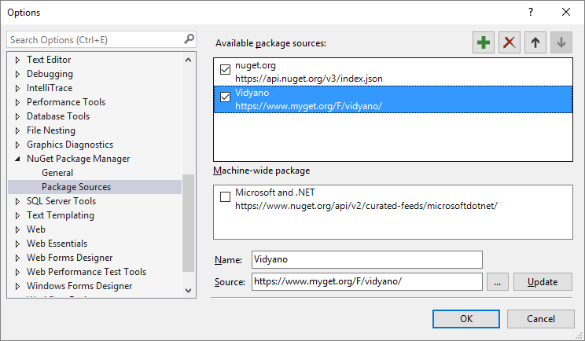
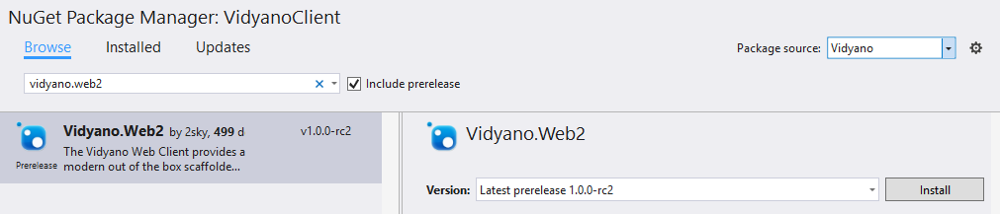
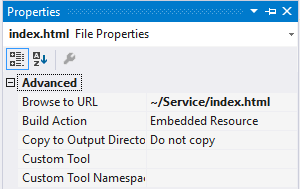

# Getting Started

## 1. Installing the NuGet package

The easiest way to use the Vidyano Web² client for your Vidyano application is by adding our NuGet package to your backend project. We host this package via our MyGet feed.

1. In Visual Studio, register the Vidyano MyGet feed (https://www.myget.org/F/vidyano/) as package source:


2. Add the Vidyano.Web2 NuGet package to your Vidyano project.

> *Note: make sure to select the Vidyano package source and optionally include prerelease packages.*

3. Add a new html file to your project with the following code:

```html
<!DOCTYPE html>
<html lang="en">
<head>
    <meta charset="utf-8" />
    <title>Your project name</title>

    <script src="web2/Libs/webcomponentsjs/webcomponents-lite.js"></script>
    <link href="//fonts.googleapis.com/css?family=Open+Sans:400,300,600,700,800" rel="stylesheet" type="text/css">
    <link rel="import" href="web2/vidyano.html" />
</head>

<body class="fullbleed">
    <vi-app uri="" label="Your project name" class="fit"></vi-app>
</body>
</html>
```

4. Run your project and navigate to the html file in your browser.

## 2. Setting the Vidyano Web² client as default

You can set the Vidyano Web² client as the default web user interface for your project by returning the contents of the html file you created in step 1.3 from your *Schema*Web class.

This class inherits from the ```Vidyano.Service.CustomWebController``` class and allows you to override the ```GetIndex``` method. This method has one parameter, ```StringBuilder html``` that, by default, contains the html code of the default Vidyano web user interface. You can clear its contents and add your own.

To get started:
1. Set the build action for the index.html file that you created in step 1.3 to **Embedded Resource**.


2. Override the GetIndex method on the *Schema*Web class.
```csharp
public class SchemaWeb : CustomWebController
{
	public override void GetIndex(StringBuilder html)
	{
		html.Clear();
		AppendEmbeddedResource(html, "index.html");
	}
}
```
> Note: The file that contains the above code was created for you during your initial project setup and is typically called *Schema*Web.cs in your project's Service folder.